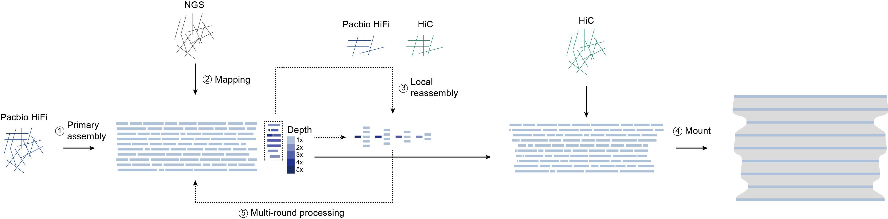

# PolyHIC
## Hi-C-guided haplotype resolution in complex polyploid genomes


## Overview

PolyHIC is a computational framework designed to identify and resolve
**haplotype-fused and chimeric contigs** during polyploid genome
assembly.

In polyploid genomes, homologous chromosomes and subgenomes often
exhibit high sequence similarity, resulting in haplotype collapse during
genome assembly. These errors may lead to incorrect chromosome
reconstruction and affect downstream genomic analyses.

PolyHIC integrates:

-   Illumina short-read sequencing depth;
-   PacBio HiFi long reads;
-   Hi-C chromatin interaction information;
-   genome ploidy information;

to perform:

1.  haplotype fusion detection;
2.  local haplotype recovery;
3.  Hi-C based haplotype validation;
4.  polyploid chromosome reconstruction.

------------------------------------------------------------------------

## Features
Module 1   Depth-based haplotype fusion detection

Module 2   HiFi-assisted local haplotype recovery

Module 3   Hi-C assisted haplotype validation

Module 4   Polyploid haplotype-aware chromosome reconstruction

## Installation
## Requirements

Python \>= 3.8

Install Python dependencies:

``` bash
pip install numpy pandas scipy scikit-learn pysam networkx
```

## External software
bwa-mem2
samtools
minimap2
hifiasm
RepeatMasker
HapHiC
## Installation

``` bash
git clone https://github.com/yourname/PolyHIC.git
cd PolyHIC
```

Project structure:

``` text
PolyHIC/

├── polyhic_depth.py
├── polyhic_reassembly.py
├── polyhic_hic.py
├── polyhic_phcr.py
├── example/
└── README.md
```

## Input Data

## 1. Initial contig assembly

Generated by hifiasm, HiCanu or Verkko.

``` text
assembly.fa
```

## 2. PacBio HiFi reads

``` text
hifi.fastq.gz
```

## 3. Illumina short reads

``` text
sample_R1.fastq.gz
sample_R2.fastq.gz
```

## 4. Genome ploidy

Example:

``` bash
--ploidy 4
```

## 5. Hi-C reads

``` text
hic_R1.fastq.gz
hic_R2.fastq.gz
```

## Modules

## Module 1

## polyhic_depth.py

### Depth-guided haplotype fusion detection

This module identifies potential haplotype-fused regions using Illumina
sequencing depth.

Normalized depth:

``` text
Normalized depth = Observed depth / Haplotype depth
```

Classification:

  Normalized depth   Classification
  ------------------ ----------------------
  \~1                haplotype-resolved
  \~2                haplotype-fused
  \>3                multi-copy/collapsed

Usage:

``` bash
python polyhic_depth.py \
-a assembly.fa \
-1 sample_R1.fastq.gz \
-2 sample_R2.fastq.gz \
--ploidy 4 \
-w 1000 \
-t 48 \
-o sample01
```

## Module 2

## polyhic_reassembly.py

### HiFi-assisted local haplotype recovery

This module extracts HiFi reads from problematic regions and performs
local reassembly.

Usage:

``` bash
python polyhic_reassembly.py \
-c sample01.classification.tsv \
--hifi-bam hifi.bam \
-o local_reassembly
```

## Module 3

## polyhic_hic.py

### Hi-C assisted haplotype validation

This module validates recovered haplotypes using Hi-C interaction
patterns.

Contact Isolation Score:

``` text
CIS = intra-haplotype contact / inter-haplotype contact
```

Usage:

``` bash
python polyhic_hic.py \
--hap1 hap1.fa \
--hap2 hap2.fa \
--hic1 hic_R1.fastq.gz \
--hic2 hic_R2.fastq.gz \
-o validation
```

## Module 4

## polyhic_phcr.py

### Polyploid haplotype-aware chromosome reconstruction

This module reconstructs chromosome-scale assemblies using Hi-C
interaction patterns.

Usage:

``` bash
python polyhic_phcr.py \
-c hic.contact.tsv \
--chromosome-number 21 \
-o chromosome_assignment.tsv
```

## Complete Pipeline Example

## Step 1: Fusion detection

``` bash
python polyhic_depth.py \
-a assembly.fa \
-1 R1.fastq.gz \
-2 R2.fastq.gz \
--ploidy 4
```

## Step 2: Local haplotype recovery

``` bash
python polyhic_reassembly.py \
-c classification.tsv \
--hifi-bam hifi.bam
```

## Step 3: Hi-C validation

``` bash
python polyhic_hic.py \
--hap1 recovered.hap1.fa \
--hap2 recovered.hap2.fa \
--hic1 hic_R1.fastq.gz \
--hic2 hic_R2.fastq.gz
```

## Step 4: Chromosome reconstruction

``` bash
python polyhic_phcr.py \
-c hic.contact.tsv \
--chromosome-number 21
```

## Output

``` text
PolyHIC_result/

├── corrected_contigs.fa
├── haplotype_assignment.tsv
├── chromosome_assignment.tsv
├── chromosome.fa
├── depth_profile/
├── hic_matrix/
└── QC_report/
```

## Applications

PolyHIC is designed for:

-   allopolyploid genome assembly;
-   autopolyploid genome assembly;
-   highly heterozygous genomes;
-   crop genome reconstruction;
-   haplotype-resolved reference genome generation;
-   polyploid pan-genome construction.
